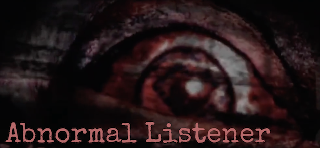

# **Abnormal Score Generator**

This is a little tool created in my postgrad research project Hope you like it ^.^ 

This is an abnormal score generator for audio files. the higher the anomaly score given, the more abnormal the detected sound should be. 

The 9-layer keras neural network model used in this abnormal score generator comes from DCASE challenge 2020 'Unsupervised Detection of Anomalous Sounds for Machine Condition Monitoring' baseline system. 

## How to Use

1. st􏰀ore trai􏰁ning fi􏰂es (.wav) i􏰁t􏰀 the ‘/train􏰁’ f􏰀􏰂older

2. store single test wav file into the '/test' folder and name it as 'testfile.wav'

3. run 'Abnormal_listener.py', in the window, firstly click 'start training' to generate a model, then click 'start monitoring' to get an abnormal score.

4. if you do not want to use the GUI please just run the start_training function and then the start_testing function. And delete the GUI codes in the bottom.

   **In the future I plan to make it real-time! (a recorder embedded, the abnormal score generator will iterate abnormal score for every 5 seconds, no need to operate files in folders) **

## Dependency

Before running the script, please install packages below:

* python 3.x.x
* ffmpeg
* matplotlib
* numpy
* scikit-learn
* librosa
* audioread
* setuptools
* tensorflow
* tqdm
* pyaudio
* keras

